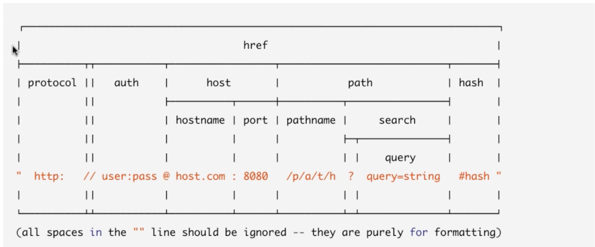

# Node for Web Server
- HTTP is a first class citizen in node
- Node was started as web server and latter generailize as evolved framework.
- Node HTTP module is designed `streaming` and low latency in mind.
- Node is very popular tool to create and run web servers.

## HTTP Response header
```
curl -i localhost:8181

HTTP/1.1 200 OK
content-type: text-plain
Date: Sun, 07 Oct 2018 22:47:27 GMT
Connection: keep-alive
Transfer-Encoding: chunked
```

- Connection: keep-alive -> It means, connection to web server will be persisted. TCP connection will not be killed after request received the response. This helps to send multiple response on same connection.
- Transfer-Endocing: chunked -> Is used to send variable response text. Its mean that response is being streamed. Node is ok to send partial chunked responses. Bcz `res` object is writable stream.

## Not to use res.end() instead use res.write()
It means response is not yet terminated. Node has more data to send.

# HTTPS Server

## Generate certificate
```
openssl req -x509 -newkey rsa:4096 -keyout key.pem -out cert.pem -nodes
```

# Requesting HTTP/HTTPS Data
```
const http = require('http');
const req = http.request({
    hostname: 'www.google.com',
    method: 'GET',
  }, (res) => {
    res.on('data', (data)=>{
      console.log(data.toString())
    })
  }
);
req.on('error', console.error);
console.log(req.agent);
req.end();
```
# http module
## http.Server
- Used to create basic server.
- It inhertis from `net.Server`
```
const http = require('http');
const server = http.createServer();
```
Here `server` is instance of `http.Server`.

## http.ServerResponse
- Created internally by `http.Server`
- It implements writable stream and event emitters.
```
const http = require('http');
const server = http.createServer();
server.on('request', (req, res) => {
  res.writeHead(200, { 'content-type': 'text-plain' });
  res.write('Hello world!!\n');
});
```
Here, `res` is object of `http.ServerResponse`.

## http.IncomingMessage
- It implements readable stream and event emitters.

Example in http server:
```
const http = require('http');
const server = http.createServer();
server.on('request', (req, res) => {
  res.writeHead(200, { 'content-type': 'text-plain' });
  res.write('Hello world!!\n');
});
```
Here, `req` is object of `http.IncomingMessage`.

Example to consume http service:
```
const http = require('http');
const req = http.request({
    hostname: 'www.google.com',
    method: 'GET',
  }, (res) => {
    res.on('data', (data)=>{
      console.log(data.toString())
    })
  }
);
req.on('error', console.error);
console.log(req.agent);
req.end();
```
Here `res` is object of `http.IncomingMessage. Yes, don't get confused here. Here `req` is object of `http.ClientRequest`.

## http.ClientRequest
It is used to consume http service.
```
const http = require('http');
const req = http.request({
    hostname: 'www.google.com',
    method: 'GET',
  }, (res) => {
    res.on('data', (data)=>{
      console.log(data.toString())
    })
  }
);
req.on('error', console.error);
console.log(req.agent);
req.end();
```
Here `req` is object of `http.ClientRequest`.

## http.Agent
- Used to manage pooling socket to manage http client.
- It implements writable stream and event emitters.
```
const http = require('http');
const req = http.request({
    hostname: 'www.google.com',
    method: 'GET',
  }, (res) => {
    res.on('data', (data)=>{
      console.log(data.toString())
    })
  }
);
req.on('error', console.error);
console.log(req.agent);
req.end();
```
Here `req.agent` is object of `http.Agent`.
## http.STATUS_CODES
It prints all the http status codes.

```
{ '100': 'Continue',
  '101': 'Switching Protocols',
  '102': 'Processing',
  '103': 'Early Hints',
  '200': 'OK',
  '201': 'Created',
  '202': 'Accepted',
  '203': 'Non-Authoritative Information',
  '204': 'No Content',
  '205': 'Reset Content',
  '206': 'Partial Content',
  '207': 'Multi-Status',
  '208': 'Already Reported',
  '226': 'IM Used',
  '300': 'Multiple Choices',
  '301': 'Moved Permanently',
  '302': 'Found',
  '303': 'See Other',
  '304': 'Not Modified',
  '305': 'Use Proxy',
  '307': 'Temporary Redirect',
  '308': 'Permanent Redirect',
  '400': 'Bad Request',
  '401': 'Unauthorized',
  '402': 'Payment Required',
  '403': 'Forbidden',
  '404': 'Not Found',
  '405': 'Method Not Allowed',
  '406': 'Not Acceptable',
  '407': 'Proxy Authentication Required',
  '408': 'Request Timeout',
  '409': 'Conflict',
  '410': 'Gone',
  '411': 'Length Required',
  '412': 'Precondition Failed',
  '413': 'Payload Too Large',
  '414': 'URI Too Long',
  '415': 'Unsupported Media Type',
  '416': 'Range Not Satisfiable',
  '417': 'Expectation Failed',
  '418': 'I\'m a teapot',
  '421': 'Misdirected Request',
  '422': 'Unprocessable Entity',
  '423': 'Locked',
  '424': 'Failed Dependency',
  '425': 'Unordered Collection',
  '426': 'Upgrade Required',
  '428': 'Precondition Required',
  '429': 'Too Many Requests',
  '431': 'Request Header Fields Too Large',
  '451': 'Unavailable For Legal Reasons',
  '500': 'Internal Server Error',
  '501': 'Not Implemented',
  '502': 'Bad Gateway',
  '503': 'Service Unavailable',
  '504': 'Gateway Timeout',
  '505': 'HTTP Version Not Supported',
  '506': 'Variant Also Negotiates',
  '507': 'Insufficient Storage',
  '508': 'Loop Detected',
  '509': 'Bandwidth Limit Exceeded',
  '510': 'Not Extended',
  '511': 'Network Authentication Required' }

```

# url module
Following is details on `url`


```
const url = require('url');
const parse = url.parse('https://team-learn-node.slack.com/messages/CCTGWM2RF/convo/CCTGWM2RF-1538947250.000100/?date=today#3:40PM');
console.log(parse);
```
It prints following output.
```
Url {
  protocol: 'https:',
  slashes: true,
  auth: null,
  host: 'team-learn-node.slack.com',
  port: null,
  hostname: 'team-learn-node.slack.com',
  hash: '#3:40PM',
  search: '?date=today',
  query: 'date=today',
  pathname: '/messages/CCTGWM2RF/convo/CCTGWM2RF-1538947250.000100/',
  path: '/messages/CCTGWM2RF/convo/CCTGWM2RF-1538947250.000100/?date=today',
  href: 'https://team-learn-node.slack.com/messages/CCTGWM2RF/convo/CCTGWM2RF-1538947250.000100/?date=today#3:40PM' }

```


## url.parse
## url.format

# queryString module
